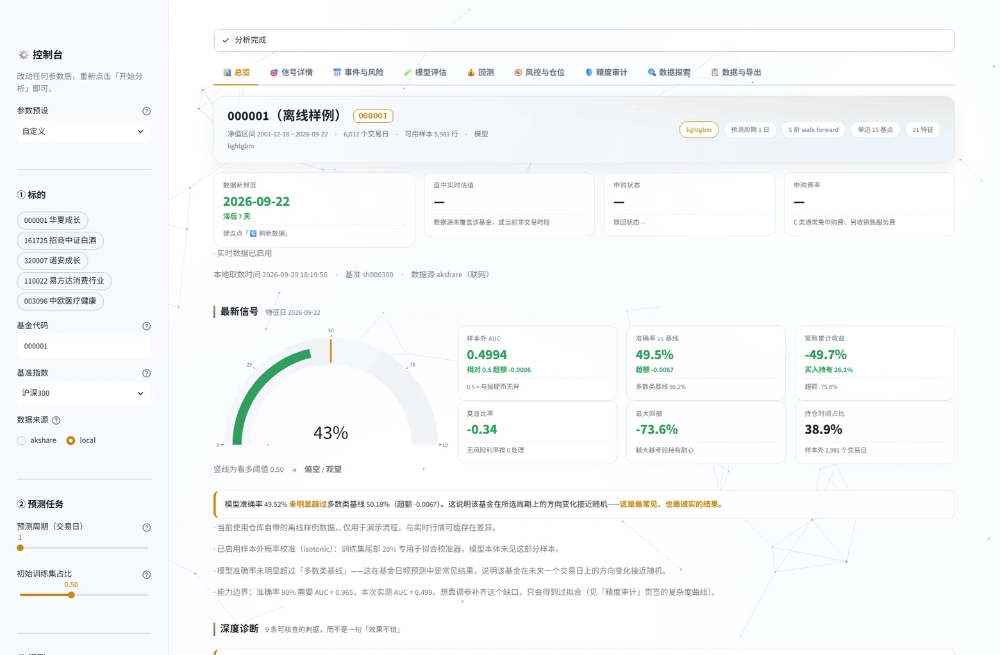
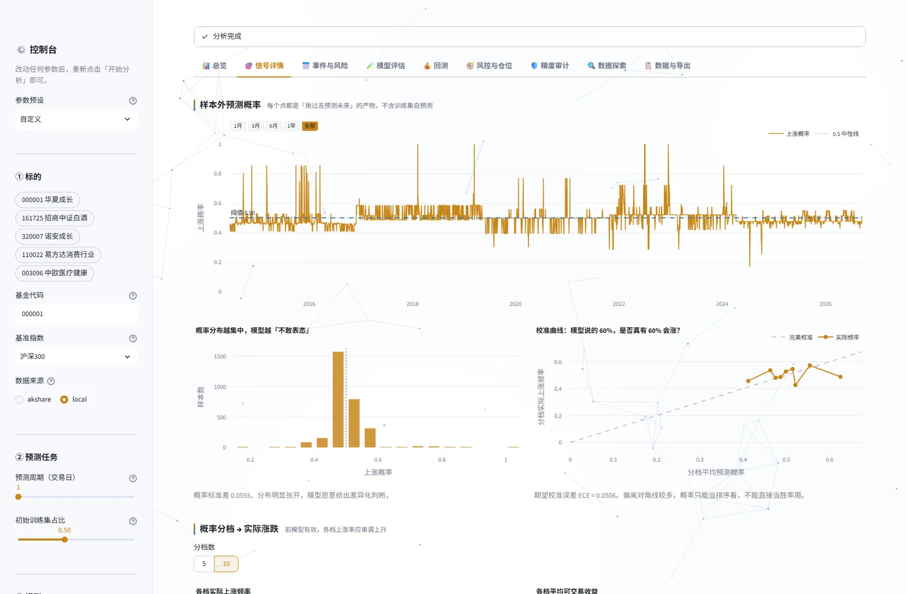
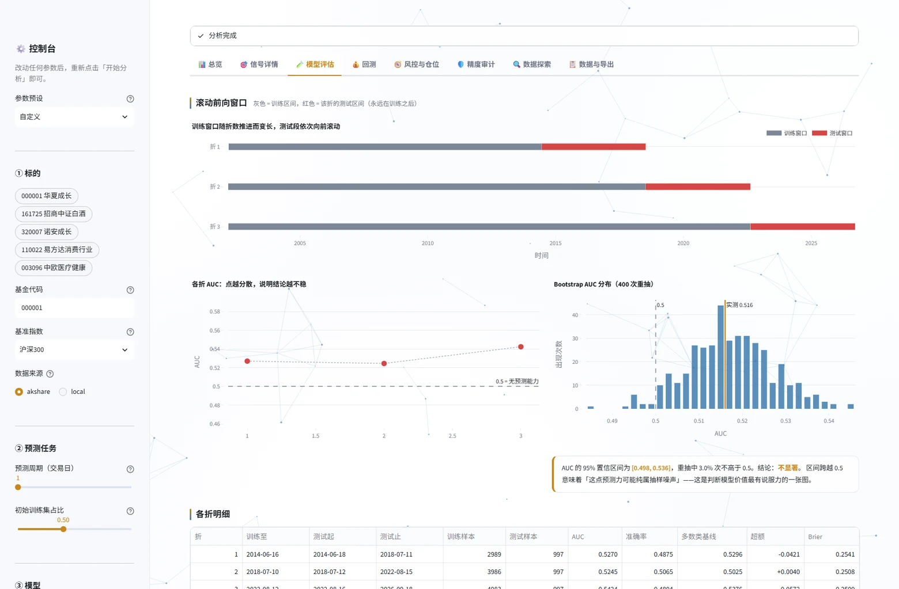
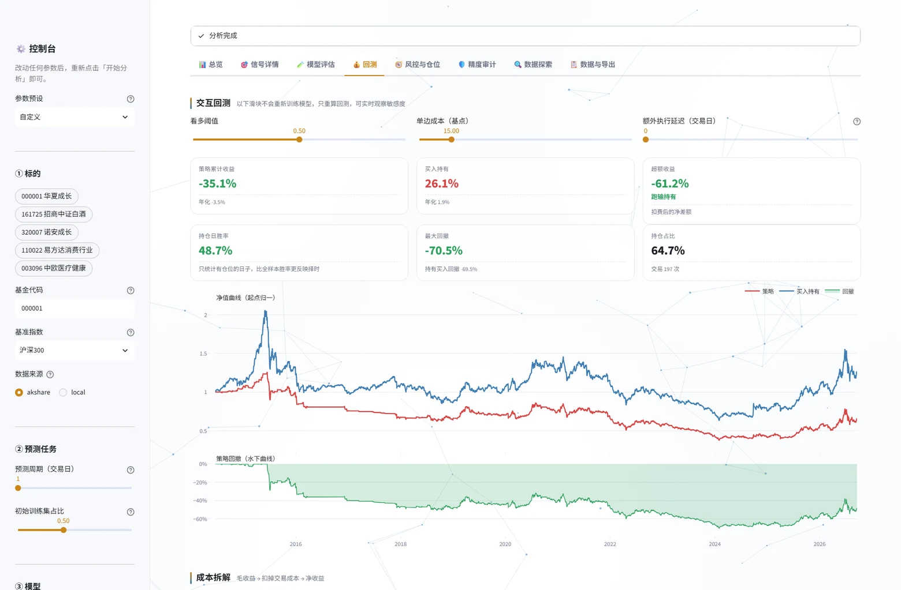
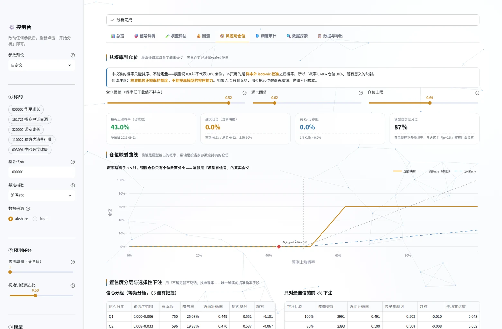
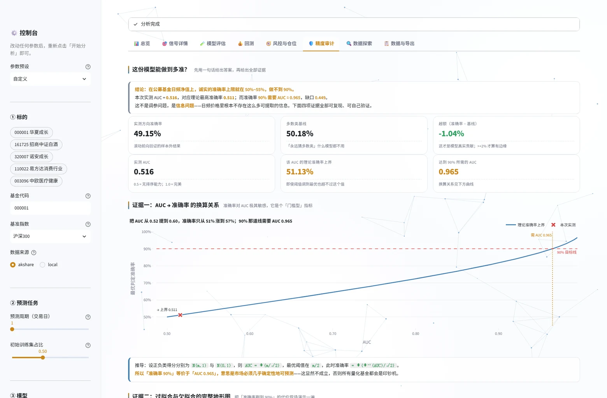
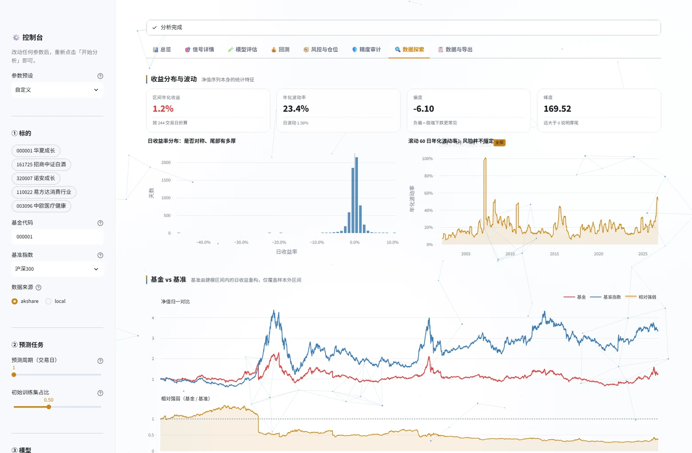
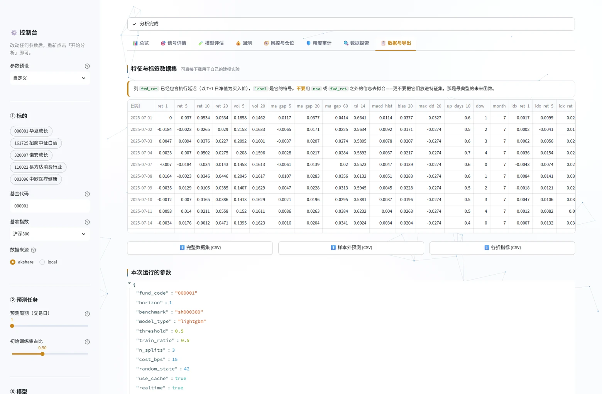

<div align="center">

# 📈 fund-signal

**公募基金量化信号分析框架**

从数据获取到样本外回测的完整链路，一套**方法论严谨**、**结果诚实**的开源工具。

[](https://www.python.org/)
[](LICENSE)
[](tests/)
[](https://github.com/wang-1168/fund-signal/actions)
[](https://github.com/astral-sh/ruff)
[](CONTRIBUTING.md)

[快速开始](#-快速开始) · [核心特性](#-核心特性) · [界面预览](#-界面预览) · [方法论](#-方法论) · [常见问题](#-常见问题) · [免责声明](#-免责声明)

<br>



<sub>↑ 总览页：数据新鲜度、最新信号、9 条判据诊断 —— 所有数字都是样本外结果，没有一个是训练集里算出来的</sub>

</div>

---

## ⚠️ 先说清楚：这个项目不承诺任何收益

市面上大量「基金预测」项目用随机划分训练集、忽略交易成本、不做样本外验证的方式，画出一条漂亮的回测曲线，然后暗示你可以据此赚钱。**本项目反其道而行**——它的默认输出长这样：

```
【样本外预测质量】（滚动前向验证，5 折）
  AUC         0.4994   （0.5 = 无预测能力）
  准确率      0.4952
  多数类基线  0.5018
  超额        -0.0067   ✗ 未超过基线

【样本外回测】（阈值 0.5，成本 15bps）
               策略     买入持有
累计收益      -49.70%   26.14%
持仓日胜率     47.94%   ← 只看有仓位的日子
```

**持仓日胜率 47.94%，比抛硬币还差一点。** 这是基金日频方向预测的真实水平，也是弱式有效市场假说下应有的结果。

> 上面的数字不是手写的，跑这一条命令即可**完全复现**（离线样例数据，不需要联网）：
>
> ```bash
> python -m fund_signal --code 000001 --data local --no-realtime --no-cache
> ```
>
> 换成联网跑真实数据时，沪深300 指数自 2005-01-04 起，与基金净值内连接后样本会少约 700 行，数字会略有差异。

那这个项目的价值在哪？

> 它演示了一套**完整的、经得起推敲的量化研究流程**，并且用可运行的代码证明了一件事：
> **「预测准确率略高于 50%」和「能赚钱」之间，隔着交易成本、风险暴露和统计显著性这三道墙。**

如果你在做量化方向的课题、课程设计、简历项目，或者单纯想搞清楚「为什么那么多基金预测模型都是骗人的」，这个项目就是你要的。

---

## 🚧 能力边界：为什么「准确率 90%」做不到

很多人拿到这类项目的第一反应是「准确率能不能做到 90% 以上」。本项目**不回避这个问题**，而是把它做成了一页可交互的实验（界面里的 **🛡️ 精度审计** 标签页），用四组证据正面回答。

**核心结论：日频净值方向预测的诚实准确率上限就在 50%~55%，90% 需要 AUC ≈ 0.965。**

理论换算关系（正负类得分服从等方差正态分布）：

```
AUC = Φ(m/√2)  →  最优判定准确率 = Φ( Φ⁻¹(AUC) / √2 )
```

| AUC | 0.500 | 0.520 | 0.550 | 0.600 | 0.700 | 0.900 | **0.965** |
|---|---|---|---|---|---|---|---|
| 理论最高准确率 | 50.0% | 51.4% | 53.5% | 57.1% | 64.5% | 81.8% | **90.0%** |

本项目在 3 只基金 × 4 个预测周期 × 2 种模型上的实测：**准确率 0.477~0.529（均值 0.503）、AUC 0.472~0.581（均值 0.516）**。要摸到 90%，AUC 还差 **0.449**——这不是调参能补的，是信息量的问题。

### 那个 90% 都是怎么来的？

| 做法 | 能刷到多少 | 代价 |
|---|---|---|
| 把训练集准确率当作模型准确率 | **99%~100%** | 自欺。样本外立刻回到 50% |
| 打乱时间做随机 K 折 | 55%~75% | 未来信息泄漏 |
| 把未来信息混进特征 | **接近 100%**（滚动前向也拦不住） | 只有泄漏审计能发现 |
| 标签/执行时点算错 | 几乎不变 | 准确率看不出来，回测收益虚高几十个百分点 |
| 罕见事件 + 恒猜多数类 | 80%~95% | 超额 = 0，模型什么都没做 |
| **选择性预测**（只在最自信的样本上下注） | 53% 左右（覆盖率 20%） | 唯一诚实的做法，代价是覆盖率；而且提升幅度很小、并不稳定 |

实测数据（000001，滚动前向 5 折）：

```
配置            训练准确率   样本外准确率   过拟合差距
极简(深度1)       0.557       0.523       +0.034   ← 欠拟合
浅树(默认)        0.613       0.512       +0.101
中等             0.743       0.515       +0.228
较深             0.997       0.524       +0.473   ← 开始过拟合
不剪枝           1.000       0.518       +0.482   ← 完全过拟合
```

**训练准确率一路冲到 100%，样本外始终趴在 50%。** 这就是「把准确率做到 90%」的全部真相。

### 我们真正做了什么

既然幻觉不能要，就把能提升的部分做到底：

| 手段 | 作用 | 实测效果 |
|---|---|---|
| **样本外概率校准**（isotonic，每折内部拟合） | 让概率具备频率含义，可直接当仓位用 | ECE 从 0.09 降到 0.04 |
| **净化间隔 embargo** | 丢弃紧邻测试段的 `horizon` 个训练样本，切断标签窗口重叠泄漏 | 严谨性提升，结果几乎不变 |
| **四模型软投票集成** | LightGBM + 逻辑回归 + ExtraTrees + GBDT，降低单模型方差 | AUC 略升，稳定性明显改善 |
| **成本/延迟建模** | 回测计入真实的申购赎回摩擦 | 毛收益 → 净收益的差额一目了然 |
| **选择性预测 + 置信度分层** | 用覆盖率换准确率，并把「超额」并排摆出来 | 唯一诚实的提准确率手段，但实测只多约 2 个百分点 |

另外，界面里的 **🧭 风控与仓位** 页把校准后的概率映射成仓位（分段线性 + Kelly 参照），并给出波动率条件收益分布与压力测试——**先决定能承受多大亏损，再倒推仓位**。

---

## ✨ 核心特性

| 特性 | 说明 |
|---|---|
| 🔒 **严格防未来函数** | 特征只用 T 日及之前的信息；`test_no_lookahead_bias` 用截断数据逐值比对，任何信息穿越都会让测试失败 |
| ⏱️ **真实的执行时序** | 标签以 **T+1 日净值**为买入价（基金 T 日晚才公布净值、T+1 日才能成交）。用 T 日净值当买入价会凭空多赚一天，是最常见的回测虚高来源 |
| 📊 **滚动前向验证** | walk-forward：每一折只用「该折之前」的数据训练。拒绝随机划分，拒绝 `TimeSeriesSplit` 以外的任何偷懒做法 |
| 💸 **计入交易成本** | 默认单边 15bps，仓位变动才计费。零成本回测毫无意义 |
| 🎯 **诚实的评估体系** | 同时输出 AUC + Bootstrap 置信区间、**多数类基线**、**持仓日胜率**、**信息系数 IC**、**Brier / ECE**——专门用来戳穿「看着还行」的幻觉 |
| 🛡️ **能力边界审计** | 一页交互实验：AUC→准确率换算曲线、**过拟合/欠拟合复杂度地形**、**泄漏审计**、置信度分层。用可复现的数据回答「准确率为什么做不到 90%」 |
| 🧭 **风控与仓位** | 校准概率 → 分段线性仓位映射（附 Kelly 参照）、概率分布、同波动率档位的条件收益分布、压力测试 |
| 🔄 **实时数据能力** | 自动补齐最新交易日净值（含"当日净值未公布时回退到上一交易日"的处理）+ 盘中实时估值 |
| 🖥️ **交互式界面** | 8 个标签页、35 张可交互图表；**canvas 粒子背景** + 玻璃拟态卡片；阈值/成本/延迟滑块**实时重算回测**，无需重新训练 |
| 🎛️ **可调的严谨性开关** | 样本外概率校准、净化间隔（防标签重叠泄漏）、四模型集成，都可在侧边栏一键开关并对比 |
| 📦 **零配置可用** | 数据源 akshare 免费无需 token；仓库自带离线样例数据，**断网也能跑通全流程** |
| ✅ **81 个单元测试** | 全部离线运行，CI 秒级完成 |

---

## 🚀 快速开始

### 环境要求

- Python **3.10+**（已在 3.10 / 3.11 / 3.12 / 3.13 上验证）
- 无需注册任何账号，无需 API Key

### 三步跑起来

```bash
# 1. 获取代码
git clone https://github.com/wang-1168/fund-signal.git
cd fund-signal

# 2. 安装依赖
pip install -r requirements.txt
# 国内网络建议加镜像源，速度快很多：
# pip install -r requirements.txt -i https://mirrors.aliyun.com/pypi/simple/

# 3. 启动交互界面
streamlit run app.py
```

浏览器会自动打开 `http://localhost:8501`，在左侧输入基金代码（如 `000001`）点「🚀 开始分析」即可。

> **网络不通？** 把左侧「数据来源」切到 `local`，会用仓库自带的离线样例数据跑通全流程，不需要联网。

### 命令行用法

```bash
# 默认参数分析（沪深300 为基准，预测下一交易日方向）
python -m fund_signal --code 000001

# 预测未来 5 个交易日，换逻辑回归，调整阈值和成本
python -m fund_signal --code 110022 --horizon 5 --model logistic --threshold 0.55 --cost-bps 20

# 强制重新拉取最新数据（等同界面上的「刷新数据」）
python -m fund_signal --code 000001 --no-cache

# 离线运行，不需要网络
python -m fund_signal --code 000001 --data local

# 查看全部参数
python -m fund_signal --help
```

### 当库调用

```python
from fund_signal.config import Config
from fund_signal.pipeline import run_analysis

result = run_analysis(Config(fund_code="000001", horizon=1, n_splits=5))

print(result.summary_metrics())
print("最新上涨概率：", result.latest_prob)
print("持仓日胜率：", result.backtest.win_rate_active)
print("模型是否真有优势：", result.has_edge)
```

更多示例见 [`examples/quickstart.py`](examples/quickstart.py)。

---

## 🖥️ 界面预览

界面分 8 个标签页、35 张可交互图表，全部可缩放、可悬停查看数值；带 canvas 粒子背景与玻璃拟态卡片。

<table>
<tr>
<td width="50%"><br>
<b>📊 总览</b> —— 数据新鲜度 / 盘中估值 / 最新信号 / 9 条判据深度诊断 / 最新特征分位定位</td>
<td width="50%"><br>
<b>🎯 信号详情</b> —— 样本外概率序列（校准前后对比）/ 概率分档实际胜率 / 滚动 Spearman IC / 校准曲线 + ECE</td>
</tr>
<tr>
<td width="50%"><br>
<b>🧪 模型评估</b> —— 滚动前向窗口 / 各折 AUC / Bootstrap AUC 置信区间 / ROC + PR / 特征分组贡献</td>
<td width="50%"><br>
<b>💰 回测</b> —— 净值曲线 + 回撤子图 / 阈值·成本·延迟实时调节 / 成本瀑布 / 阈值前沿 / 回撤持续期</td>
</tr>
<tr>
<td width="50%"><br>
<b>🧭 风控与仓位</b> —— 概率 → 仓位映射（含 Kelly 参照）/ 置信度分层 / 选择性预测 / 同波动率档位条件收益 / 压力测试</td>
<td width="50%"><br>
<b>🛡️ 精度审计</b> —— AUC → 准确率理论换算曲线 / 过拟合·欠拟合复杂度地形 / 泄漏审计 / 多数类基线对照</td>
</tr>
<tr>
<td width="50%"><br>
<b>🔍 数据探索</b> —— 日收益率分布 / 滚动波动率 / 基金 vs 基准 / 特征分箱表现 / 相关性热力图</td>
<td width="50%"><br>
<b>📋 数据与导出</b> —— 完整数据集 / 样本外预测 / 各折指标一键导出 CSV / 参数快照 / 方法论速览</td>
</tr>
</table>

<details>
<summary><b>各标签页详细说明</b></summary>

| 标签页 | 内容 |
|---|---|
| 📊 **总览** | 数据新鲜度 / 盘中估值 / 申赎状态 / 最新信号 / 9 条判据深度诊断 / 最新特征分位定位 / 净值走势 |
| 🎯 **信号详情** | 样本外概率序列（含校准前后对比）、概率分档实际胜率、**滚动 Spearman IC**、**概率校准曲线 + ECE**、信号持仓区间 |
| 🧪 **模型评估** | 滚动前向窗口图、各折 AUC、**Bootstrap AUC 置信区间**、ROC + PR 曲线、特征重要性（含分组贡献）、混淆矩阵 |
| 💰 **回测** | 净值曲线 + 回撤子图、**阈值/成本/延迟实时调节**、**成本瀑布拆解**、阈值前沿散点、月度/年度收益、**回撤持续期** |
| 🧭 **风控与仓位** | 概率 → 仓位映射曲线（含 Kelly 参照）、置信度分层、**选择性预测**、校准前后概率分布、同波动率档位条件收益、压力测试 |
| 🛡️ **精度审计** | **AUC→准确率理论换算**、**过拟合/欠拟合复杂度地形**、**泄漏审计**、多数类基线对照、五种「刷准确率」手段的代价 |
| 🔍 **数据探索** | 日收益率分布、滚动波动率、基金 vs 基准、特征分箱表现、特征相关性热力图 |
| 📋 **数据与导出** | 完整数据集 / 样本外预测 / 各折指标一键导出 CSV、参数快照、方法论速览 |

</details>

配色遵循中国市场惯例：**红涨绿跌**。

> **性能提示**：「精度审计」页首次打开会跑一遍复杂度扫描（5 档复杂度 × 5 折滚动前向，约 20~30 秒），结果缓存 6 小时。不想等可以关掉这个标签页直接看别的。

> **截图说明**：以上截图取自 `000001 华夏成长混合` 的默认参数运行结果（离线样例数据，可完全复现）。

---

## 🔬 方法论

### 为什么不用随机划分训练集？

金融时间序列有强自相关。随机划分会让「未来样本」进入训练集，模型相当于开卷考试，AUC 轻松刷到 0.7+，但实盘一文不值。本项目使用**滚动前向验证**：

```
折 1: [────────训练────────][测试]
折 2: [──────────训练──────────][测试]
折 3: [────────────训练────────────][测试]
                        ↑ 训练数据永远早于被预测样本
```

### 标签为什么以 T+1 日为起点？

公募基金的真实交易流程：

1. T 日收盘后（约 20:00）公布 T 日净值；
2. 投资者在 **T+1 日 15:00 前**提交申购，按 **T+1 日净值**成交。

所以 T 日晚上算出的信号，最早只能在 T+1 日成交。如果像很多项目那样用 `nav[T+1]/nav[T] - 1` 作为可交易收益，相当于假设「看完 T 日净值还能按 T 日净值买入」——**凭空多赚一天**。

本项目定义为：

```
buy_price  = nav[T + 1]              # T+1 日按净值成交
sell_price = nav[T + 1 + horizon]    # 持有 horizon 个交易日后卖出
tradeable_ret[T] = sell_price / buy_price - 1
```

### 特征清单（21 个）

| 类别 | 特征 |
|---|---|
| 动量 | `ret_1` `ret_5` `ret_10` `ret_20` |
| 波动 | `vol_5` `vol_20` |
| 均线偏离 | `ma_gap_5` `ma_gap_20` `ma_gap_60` |
| 技术指标 | `rsi_14` `macd_hist` `bias_20` |
| 风险 | `max_dd_20` `up_days_10` |
| 市场环境 | `idx_ret_1` `idx_ret_5` `idx_ret_20` `rel_strength_20` `corr_20` |
| 日历效应 | `dow` `month` |

所有特征均可在 T 日收盘后计算完成，不含任何未来信息。详见 [`docs/methodology.md`](docs/methodology.md)。

### 评估指标为什么这么设计

| 指标 | 作用 |
|---|---|
| **AUC** | 阈值无关的排序能力。0.5 = 无预测能力 |
| **多数类基线** | 「永远猜涨（或跌）」的准确率。**模型没超过它 = 什么都没学到** |
| **持仓日胜率** | 只统计有仓位的日子。全样本胜率会把空仓日（收益恰好为 0）算进分母，系统性低估 |
| **信息系数 IC** | 概率与未来收益的秩相关，不依赖阈值。\|IC\| < 0.03 基本是噪音 |
| **卡玛比率** | 年化收益 / 最大回撤，比夏普更贴近真实体感 |

---

## 📁 项目结构

```
fund-signal/
├── app.py                      # Streamlit 交互界面（8 页签 + 粒子背景）
├── fund_signal/
│   ├── config.py               # 参数中心
│   ├── data.py                 # 数据获取（含实时净值/盘中估值）+ 缓存
│   ├── features.py             # 特征工程（严格防未来函数）
│   ├── model.py                # 滚动前向验证 + 校准 + 集成 + LightGBM/逻辑回归
│   ├── audit.py                # 能力边界审计（AUC 换算 / 复杂度地形 / 泄漏审计）
│   ├── backtest.py             # 回测（含执行延迟与交易成本）
│   ├── metrics.py              # 分类质量 + 策略绩效指标
│   ├── pipeline.py             # 端到端编排
│   └── __main__.py             # 命令行入口
├── examples/
│   ├── quickstart.py           # 当库调用的示例
│   └── sample_data/            # 离线样例数据（断网可用）
├── scripts/
│   ├── build_sample_data.py    # 重新生成离线样例数据
│   └── verify_claims.py        # 复现并校验本文档引用的全部实测数字
├── tests/                      # 81 个单元测试（全部离线）
├── docs/
│   ├── methodology.md          # 方法论详解
│   └── screenshots/            # 界面截图（README 预览用）
├── requirements.txt
└── pyproject.toml
```

---

## ❓ 常见问题

<details>
<summary><b>能不能把准确率做到 90% 以上？</b></summary>

**不能，而且任何声称能做到的项目都在骗你。** 详见上面的「能力边界」章节。

换算关系是硬的：90% 准确率需要 **AUC ≈ 0.965**，本项目在 3 只基金 × 4 个周期的实测 AUC 均值是 **0.516**。缺口 0.449 不是调参能补的——那需要日频净值里真的存在这么多信息，而它不存在。

你可以自己去界面里的 **🛡️ 精度审计** 页验证：

- 把模型复杂度从「极简」一路拉到「不剪枝」，**训练准确率会从 56% 冲到 100%**，样本外始终在 50%~52% 抖动；
- 往特征里塞一列 `fwd_ret`（未来收益本身），**严格的滚动前向验证也会给出 100% 准确率**；
- 把标签改成「T 日买入」（未来函数），准确率几乎不变——**说明准确率这个指标根本查不出未来函数**。

所以「准确率 90%」只有两条路：作弊，或者过拟合。本项目两条都不走。

如果你想看「诚实的条件下准确率最高能到多少」，去 **🧭 风控与仓位** 页的**选择性预测**表。本项目在 `000001` 上的实测是：下注最自信的前 **20%** 时准确率 0.533、超额 **+0.022**；而前 **5%** 反而只有 0.520、超额 **−0.013**——置信度更高并不等于更准。

**这就是「诚实的准确率提升」的全部家底：约 2 个百分点，而且换个基金、换个周期就可能消失。** 任何宣称靠「只在高置信度时出手」把准确率稳定做到 70% 的说法，都需要先给你看那 20% 样本的**基线**是多少。
</details>

<details>
<summary><b>为什么我的结果和「年化 20%」的基金预测项目差这么多？</b></summary>

因为那些项目多半犯了下面一个或多个错误：随机划分训练集、用了未来数据、忽略交易成本、只在单一样本上报告结果、或者干脆把「累计收益」和「年化收益」搞混。

本项目把这些问题都堵上了，所以结果看起来"不好看"——**但这个难看的结果才是真的**。
</details>

<details>
<summary><b>预测 A 股 ETF 行不行？</b></summary>

可以，但需要改造。ETF 有盘中连续交易和场内价格，`fund_open_fund_info_em` 拿不到。可以换用 `ak.fund_etf_hist_em`，并把执行时序假设从「T+1 按净值成交」改为「T 日收盘价成交」（ETF 日内可交易）。`backtest.py` 的 `execution_lag` 参数就是为这类调整预留的。
</details>

<details>
<summary><b>盘中估值接口为什么对某些基金没数据？</b></summary>

`fund_value_estimation_em` 只覆盖约 687 只基金（数据源按持仓可拟合度筛选），且仅在交易时段有值。取不到时返回 `None`，界面显示为 `—`。这是数据源覆盖范围决定的，不是 bug。
</details>

<details>
<summary><b>提示"样本量不足"怎么办？</b></summary>

时序验证需要足够长的历史。建议：换一只成立更早的基金、把 `horizon` 调小、或降低 `n_splits`。项目要求至少 150 行可用样本（推荐 350+）。
</details>

<details>
<summary><b>pip 安装很慢 / 卡住？</b></summary>

国内直连 PyPI 拉 akshare、streamlit 这种依赖多的包会非常慢。加上镜像源即可：
```bash
pip install -r requirements.txt -i https://mirrors.aliyun.com/pypi/simple/
```
另外，如果你的系统设置了 `HTTP_PROXY` 环境变量但代理已经失效，pip 会一直卡在超时上。可以临时清掉：
```bash
# Linux / macOS / Git Bash
unset HTTP_PROXY HTTPS_PROXY http_proxy https_proxy
# Windows PowerShell
Remove-Item Env:HTTP_PROXY, Env:HTTPS_PROXY -ErrorAction SilentlyContinue
```
</details>

<details>
<summary><b>可以用于实盘吗？</b></summary>

**不可以，也不建议。** 项目输出的是统计信号，默认结果已经显示它不具备可交易的优势。请把它当作学习与研究的工具。
</details>

---

## 🤝 参与贡献

欢迎提 Issue 和 PR！特别欢迎这几类贡献：

- 🐛 报告数据源接口变更（akshare 接口变动较频繁）
- 📊 补充新的特征或评估指标
- 🌍 适配 A 股 ETF / 港股基金 / 美股 ETF
- 📖 完善文档与示例

提交前请先跑通测试：

```bash
pytest tests/ -v
```

详见 [CONTRIBUTING.md](CONTRIBUTING.md)。

---

## ⚖️ 免责声明

1. 本项目为**量化研究方法论演示与教学工具**，不构成任何投资建议。
2. 所有输出均为基于历史数据的统计结果，**历史表现不代表未来收益**。
3. 公募基金净值的短期走势接近随机，本项目已通过样本外验证展示这一点。
4. 数据来源于 akshare 聚合的公开接口，仅供学习研究使用，不保证准确性与及时性。
5. **投资有风险，决策需谨慎。因使用本项目产生的任何损失，作者不承担责任。**

---

## 📄 License

[MIT](LICENSE) © 2026 [wang-1168](https://github.com/wang-1168)

<div align="center">

**如果这个项目帮你搞懂了「为什么基金预测大多是骗人的」，欢迎点个 ⭐ Star**

</div>
