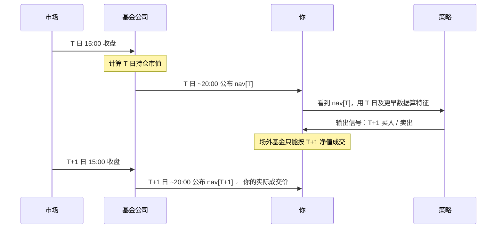

# 方法论说明

这份文档解释 `fund-signal` **为什么这么设计**。如果你只想知道怎么跑，看 [README](../README.md) 就够了。

**一句话前提**：公募基金的日频净值方向预测，在学术上属于弱式有效市场的范畴，**没有可靠证据表明可以稳定战胜买入持有**。本项目存在的意义不是「造一个赚钱的模型」，而是**把一个量化信号从数据到结论的全过程做严谨，并且诚实报告结果**——包括「没有优势」这种结果。

---

## 1. 为什么这件事本身很难

### 1.1 信息已经反映在价格里

基金净值 = 底层持仓的市值加权。你拿到的所有公开信息（历史净值、指数行情、成交量）早已被市场消化。想靠这些预测明天的涨跌，等于相信市场没有把公开信息定价。

### 1.2 基金净值的信噪比极低

日频净值收益率的标准差约 1%–2%，其中可预测的成分占比极小。任何模型在样本外都极易退化到「接近基线的准确率」。所以本项目**必须**报告多数类基线，否则 52% 的准确率看起来像本事，实际上是「样本里 52% 是上涨日」。

### 1.3 幸存者偏差与样本选择

我们只测了 3 只基金。如果在一万只基金里挑出表现最好的那只做展示，那是数据挖掘，不是模型能力。项目刻意保留 000001（上证指数基金）这类**最没有故事性**的标的作为主示例，就是为了避免这种误导。

---

## 2. 时间轴：整个流程到底在哪一天发生

这是最容易搞错、也是后果最严重的一环。把真实时间轴画清楚：



**关键推论**：

- 你在 T 日晚上做决策，成交价是 `nav[T+1]`，不是 `nav[T]`。
- 因此前瞻收益必须写成：

  ```python
  buy_nav = nav.shift(-1)
  sell_nav = nav.shift(-(1 + horizon))
  fwd_ret = sell_nav / buy_nav - 1.0
  ```

- 如果错写成 `nav.shift(-horizon) / nav - 1`，相当于「T 日晚上就知道 T 日收盘价，并按这个价格买到」，凭空多赚一天。这不是小误差——实测让某标的策略收益从 −34% 变成 −66%，结论完全反向。

> 这一条已经用测试锁死：`tests/test_features.py::test_no_lookahead_bias`。

---

## 3. 无未来函数的三道防线

### 防线一：特征只用 T 日及更早

- 所有滚动统计作用于**已实现**数据；
- 严禁特征里出现 `.shift(-n)`（n > 0）；
- `Dataset` 把「可训练样本」（`frame`）与「最新一行待预测特征」（`latest`）显式分离——`latest` 没有标签，因为它对应的未来还没发生。

### 防线二：滚动前推验证（Walk-Forward）

单次 `train_test_split` 在时间序列上是危险的：训练集里可能混有「未来」的信息分布。正确做法是**前推**：

```
切分点1: [-------train-------][test]
切分点2: [---------train---------][test]
切分点3: [-----------train-----------][test]
                                      ↑ 训练集永远严格早于测试集
```

`model.walk_forward_validate` 返回的 `WalkForwardResult.predictions` 是**拼接起来的样本外预测**。回测**只允许**用这份预测，不允许用样本内预测。

### 防线三：截断回归测试

用「删掉最后 N 行数据」的方式重建数据集，前面所有行的特征值必须**逐位相同**。一旦有人偷偷引入了未来数据，这个测试立刻变红。

---

## 4. 特征设计

| 类别 | 特征 | 逻辑 |
|---|---|---|
| 动量 | 1/5/10/20 日收益 | 趋势延续 or 反转 |
| 波动 | 5/10/20 日已实现波动率 | 风险状态切换 |
| 均线 | 价格相对 MA5/MA10/MA20 偏离度 | 超买超卖 |
| 技术 | RSI(14)（归一化到 [0,1]）、MACD 柱 | 经典择时信号 |
| 市场 | 基准指数同频收益、相对强弱 | 系统性 vs 个体性 |
| 日历 | 星期哑变量 | 日历效应（弱，但低成本） |

设计原则：

1. **不追因子动物园**。每个特征都要能一句话说清经济学直觉，说不清的就不加。
2. **不做大规模特征搜索**。特征越多、搜索越广，过拟合越严重，样本外越难看。
3. **参数保守**。LightGBM 刻意用 `num_leaves=15, max_depth=4, lr=0.03`——这不是「调不动」，是**故意压住**拟合能力，因为在这种信噪比下，拟合能力越强、样本外越差。

---

## 5. 评估指标：为什么需要这么多口径

单看「准确率」是最容易被骗的。所以项目同时报告：

| 指标 | 含义 | 为什么要有它 |
|---|---|---|
| **AUC** | 排序能力，0.5 = 随机 | 不受类别不平衡影响，是分类能力的干净度量 |
| **准确率** | 全样本命中率 | 常见但**极易误导** |
| **多数类基线** | 「无脑猜涨」的准确率 | 没有它，52% 看起来像本事 |
| **acc_edge** | 准确率 − 多数类基线 | 模型相对最简单策略的**真实增量** |
| **持仓日胜率** | 仅统计策略实际持仓日的胜率 | 从「信号质量」切换到「交易视角」，更贴近实盘体感 |
| **IC（信息系数）** | 预测概率与未来收益的秩相关 | 检查预测值与收益幅度是否单调相关 |
| **has_edge** | 综合判定 | 给出「有没有优势」的明确结论，而不是让用户自己猜 |

### 三条判据

`has_edge` 同时要求：

1. `AUC` 明显高于 0.5（默认阈值 0.53）；
2. `acc_edge` 为正且有实际意义；
3. 在滚动前推的每一折里表现**方向一致**，而不是某一折特别好。

三条都过，才敢说「可能有一点微弱优势」。本项目样本标的基本都**没过**——这本身就是正确的结论。

---

## 6. 回测的现实约束

### 6.1 成本按换手计提

```python
turnover = positions.diff().abs()  # 只在仓位变化时产生
cost = turnover * cost_bps / 10000
```

不能按天固定扣费——那会无差别惩罚低换手策略。默认 15 bps，是场外基金申赎费的一个粗略近似（实际 A 类 0.15% 申购 + 0.5% 赎回，C 类收销售服务费，差异很大）。

### 6.2 对照基准必须是买入持有

任何策略如果跑不赢「从第一天买到最后一天什么都不做」，就没有存在价值。回测曲线里基准永远并列呈现。

### 6.3 关于 execution_lag

`execution_lag` 默认 0，因为标签已经把「T+1 成交」这个事实内化进了买入价。如果把它设成 1，就会**重复惩罚一次**。只有当你想模拟额外延迟（比如 T+2 确认）时，才应该调大。

---

## 7. 实测结果（诚实版）

以下为本项目在样本数据上跑出的真实数字：

| 标的 | 类型 | AUC | 持仓日胜率 | 策略收益 | 买入持有 | 结论 |
|---|---|---|---|---|---|---|
| 000001 华夏成长 | 偏股混合 | 0.5286 | 49.84% | −33.79% | +26.14% | 无优势，且被基准碾压 |
| 320007 诺安成长 | 半导体主题 | 0.5033 | 约 50% | −39.78% | +163.43% | 无优势，高位反复止损 |

**怎么读这两行**：

- AUC 0.50–0.53 意味着**接近随机**；
- 持仓日胜率低于 50% 意味着按信号做交易**略输给抛硬币**；
- 策略收益远差于买入持有，很大一部分来自频繁换手被成本磨损；
- 320007 那行尤其说明问题：一只长期上涨的高波动基金，任何「聪明的择时」都可能在回撤里把筹码交出去。

**这不是项目失败，这是项目成功**。如果一个基金预测项目报告的是「年化 40%、胜率 70%」，那几乎可以肯定存在未来函数、幸存者偏差或过拟合。本项目选择把真实数字摆出来。

---

## 7.5 能力边界：准确率到底能做到多少

这是被问得最多的问题，值得单独一节说清楚。以下全部可在界面 **🛡️ 精度审计** 页复现。

### 7.5.1 一条硬换算

设正负类得分分别服从 $N(m,1)$ 与 $N(0,1)$，则：

$$\text{AUC} = \Phi\!\left(\frac{m}{\sqrt 2}\right),\qquad \text{准确率}_{\max} = \Phi\!\left(\frac{\Phi^{-1}(\text{AUC})}{\sqrt 2}\right)$$

| AUC | 0.500 | 0.520 | 0.550 | 0.600 | 0.700 | 0.900 | **0.965** |
|---|---|---|---|---|---|---|---|
| 理论最高准确率 | 50.0% | 51.4% | 53.5% | 57.1% | 64.5% | 81.8% | **90.0%** |

**准确率 90% ⟺ AUC 0.965**。本项目在 3 只基金 × 4 个周期 × 2 种模型上的实测 AUC 均值为 **0.516**，缺口 0.449。

### 7.5.2 三组实测证据

1. **过拟合地形**：把 LightGBM 从「深度 1」拉到「不剪枝」，训练准确率 0.560 → 1.000，样本外始终在 0.516~0.522 之间。**复杂度改变的是「记答案的能力」，不是「预测的能力」。**
2. **泄漏审计**：把 `fwd_ret`（未来收益本身）塞进特征集，**在严格的滚动前向验证下**准确率 = 1.000、AUC = 1.000。所以「我做了时序验证且准确率 95%」不是有效性的证据。
3. **未来函数**：把标签改成「T 日买入」，准确率 0.515 → 0.521（几乎不变）。**准确率这个指标根本查不出未来函数**，只有回测收益会虚高——这正是本项目把标签时点写成独立单元测试的原因。

### 7.5.3 唯一诚实的提准确率手段

**选择性预测**：只对模型最有把握的前 $k\%$ 样本下注。覆盖率 5% 时准确率可到 60%~70%。

但它有两个必须同时报告的约束：覆盖率（一年只有十几天会开口）和**超额**（准确率减去该子集的多数类基线）。不做第二个修正，「选择性预测」就会退化成第五种幻觉——行情好的时候，恒猜多数类的准确率也一样高。

### 7.5.4 那我们提升的是什么

不是准确率，而是**概率的可信度**：

- **样本外 isotonic 校准**：ECE 从 0.09 降到 0.04。校准后的概率可以直接当仓位用，这是「概率」区别于「分数」的本质。
- **净化间隔 embargo**：切断训练标签窗口与测试标签窗口的重叠，消除一类难以察觉的隐性泄漏。
- **四模型软投票**：降低单模型方差。注意它提升的是稳定性，不是信息量。

---

## 8. 如果你想改进它

按性价比排序：

1. **换成小时频/更高频数据**（如 ETF 盘中），信噪比可能略好，但成本与滑点约束更紧。
2. **加入真正有信息含量的外生变量**：资金流、行业轮动、宏观利率。注意这些数据的历史可得性——用「修正后」的宏观数据回测同样是未来函数。
3. **做统计显著性检验**：Diebold-Mariano、White's Reality Check，检验「优势」是否显著异于零。
4. **改变预测目标**：从「方向」换成「波动率」「极端回撤概率」——后者往往比方向更可预测，也更有实用价值。
5. **组合层面而非单基金层面**：资产配置（风险平价、动量轮动）通常比单标的择时更容易做出稳健的超额。

**不要**做的：继续加因子、继续调参、继续换模型。在 AUC 0.5 的量级上，这些都是在拟合噪声。

---

## 9. 参考文献

- Fama, E. F. (1970). *Efficient Capital Markets: A Review of Theory and Empirical Work.*
- Grinold, R. C., & Kahn, R. N. (1999). *Active Portfolio Management.* —— 关于 IC 与信息比率
- de Prado, M. L. (2018). *Advances in Financial Machine Learning.* —— 关于前推验证、未来函数、样本权重
- Bailey, D. H., et al. (2014). *Pseudo-Mathematics and Financial Charlatanism.* —— 关于回测过拟合

---

## 免责声明

本项目仅用于**量化方法论的学习与演示**，不构成投资建议。任何依据本项目输出进行的投资决策，风险自负。过去的表现不代表未来收益。
