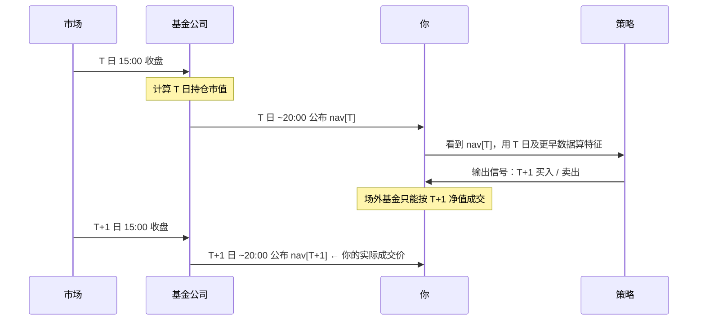

# 方法论说明

这份文档解释 `fund-signal` **为什么这么设计**。如果你只想知道怎么跑，看 [README](../README.md) 就够了。

**一句话前提**：公募基金的日频净值方向预测，在学术上属于弱式有效市场的范畴，**没有可靠证据表明可以稳定战胜买入持有**。本项目存在的意义不是「造一个赚钱的模型」，而是**把一个量化信号从数据到结论的全过程做严谨，并且诚实报告结果**——包括「没有优势」这种结果。

---

## 1. 为什么这件事本身很难

### 1.1 信息已经反映在价格里

基金净值 = 底层持仓的市值加权。你拿到的所有公开信息（历史净值、指数行情、成交量）早已被市场消化。想靠这些预测明天的涨跌，等于相信市场没有把公开信息定价。

### 1.2 基金净值的信噪比极低

日频净值收益率的标准差约 1%–2%，其中可预测的成分占比极小。任何模型在样本外都极易退化到「接近基线的准确率」。所以本项目**必须**报告多数类基线，否则 52% 的准确率看起来像本事，实际上是「样本里 52% 是上涨日」。

### 1.3 幸存者偏差与样本选择

我们只测了 3 只基金。如果在一万只基金里挑出表现最好的那只做展示，那是数据挖掘，不是模型能力。项目刻意保留 000001（上证指数基金）这类**最没有故事性**的标的作为主示例，就是为了避免这种误导。

---

## 2. 时间轴：整个流程到底在哪一天发生

这是最容易搞错、也是后果最严重的一环。把真实时间轴画清楚：



**关键推论**：

- 你在 T 日晚上做决策，成交价是 `nav[T+1]`，不是 `nav[T]`。
- 因此前瞻收益必须写成：

  ```python
  buy_nav = nav.shift(-1)
  sell_nav = nav.shift(-(1 + horizon))
  fwd_ret = sell_nav / buy_nav - 1.0
  ```

- 如果错写成 `nav.shift(-horizon) / nav - 1`，相当于「T 日晚上就知道 T 日收盘价，并按这个价格买到」，凭空多赚一天。这不是小误差——实测让某标的策略收益从 −34% 变成 −66%，结论完全反向。

> 这一条已经用测试锁死：`tests/test_features.py::test_no_lookahead_bias`。

---

## 3. 无未来函数的三道防线

### 防线一：特征只用 T 日及更早

- 所有滚动统计作用于**已实现**数据；
- 严禁特征里出现 `.shift(-n)`（n > 0）；
- `Dataset` 把「可训练样本」（`frame`）与「最新一行待预测特征」（`latest`）显式分离——`latest` 没有标签，因为它对应的未来还没发生。

### 防线二：滚动前推验证（Walk-Forward）

单次 `train_test_split` 在时间序列上是危险的：训练集里可能混有「未来」的信息分布。正确做法是**前推**：

```
切分点1: [-------train-------][test]
切分点2: [---------train---------][test]
切分点3: [-----------train-----------][test]
                                      ↑ 训练集永远严格早于测试集
```

`model.walk_forward_validate` 返回的 `WalkForwardResult.predictions` 是**拼接起来的样本外预测**。回测**只允许**用这份预测，不允许用样本内预测。

### 防线三：截断回归测试

用「删掉最后 N 行数据」的方式重建数据集，前面所有行的特征值必须**逐位相同**。一旦有人偷偷引入了未来数据，这个测试立刻变红。

---

## 4. 特征设计

| 类别 | 特征 | 逻辑 |
|---|---|---|
| 动量 | 1/5/10/20 日收益 | 趋势延续 or 反转 |
| 波动 | 5/10/20 日已实现波动率 | 风险状态切换 |
| 均线 | 价格相对 MA5/MA10/MA20 偏离度 | 超买超卖 |
| 技术 | RSI(14)（归一化到 [0,1]）、MACD 柱 | 经典择时信号 |
| 市场 | 基准指数同频收益、相对强弱 | 系统性 vs 个体性 |
| 日历 | 星期哑变量 | 日历效应（弱，但低成本） |

设计原则：

1. **不追因子动物园**。每个特征都要能一句话说清经济学直觉，说不清的就不加。
2. **不做大规模特征搜索**。特征越多、搜索越广，过拟合越严重，样本外越难看。
3. **参数保守**。LightGBM 刻意用 `num_leaves=15, max_depth=4, lr=0.03`——这不是「调不动」，是**故意压住**拟合能力，因为在这种信噪比下，拟合能力越强、样本外越差。

---

## 5. 评估指标：为什么需要这么多口径

单看「准确率」是最容易被骗的。所以项目同时报告：

| 指标 | 含义 | 为什么要有它 |
|---|---|---|
| **AUC** | 排序能力，0.5 = 随机 | 不受类别不平衡影响，是分类能力的干净度量 |
| **准确率** | 全样本命中率 | 常见但**极易误导** |
| **多数类基线** | 「无脑猜涨」的准确率 | 没有它，52% 看起来像本事 |
| **acc_edge** | 准确率 − 多数类基线 | 模型相对最简单策略的**真实增量** |
| **持仓日胜率** | 仅统计策略实际持仓日的胜率 | 从「信号质量」切换到「交易视角」，更贴近实盘体感 |
| **IC（信息系数）** | 预测概率与未来收益的秩相关 | 检查预测值与收益幅度是否单调相关 |
| **has_edge** | 综合判定 | 给出「有没有优势」的明确结论，而不是让用户自己猜 |

### 三条判据

`has_edge` 同时要求：

1. `AUC` 明显高于 0.5（默认阈值 0.53）；
2. `acc_edge` 为正且有实际意义；
3. 在滚动前推的每一折里表现**方向一致**，而不是某一折特别好。

三条都过，才敢说「可能有一点微弱优势」。本项目样本标的基本都**没过**——这本身就是正确的结论。

---

## 6. 回测的现实约束

### 6.1 成本按换手计提

```python
turnover = positions.diff().abs()  # 只在仓位变化时产生
cost = turnover * cost_bps / 10000
```

不能按天固定扣费——那会无差别惩罚低换手策略。默认 15 bps，是场外基金申赎费的一个粗略近似（实际 A 类 0.15% 申购 + 0.5% 赎回，C 类收销售服务费，差异很大）。

### 6.2 对照基准必须是买入持有

任何策略如果跑不赢「从第一天买到最后一天什么都不做」，就没有存在价值。回测曲线里基准永远并列呈现。

### 6.3 关于 execution_lag

`execution_lag` 默认 0，因为标签已经把「T+1 成交」这个事实内化进了买入价。如果把它设成 1，就会**重复惩罚一次**。只有当你想模拟额外延迟（比如 T+2 确认）时，才应该调大。

---

## 7. 实测结果（诚实版）

以下为本项目在**仓库自带的离线样例数据**上跑出的真实数字（当前默认参数：滚动前向 5 折、开启概率校准与净化间隔、单边成本 15 bps）。全部可用 `python -m fund_signal --code <代码> --data local` 复现：

| 标的 | 类型 | 样本 | AUC | 准确率 | 多数类基线 | 持仓日胜率 | 策略收益 | 买入持有 | 结论 |
|---|---|---|---|---|---|---|---|---|---|
| 000001 华夏成长 | 偏股混合 | 5,981 | 0.4994 | 49.52% | 50.18% | 47.94% | −49.70% | +26.14% | 无优势，且被基准碾压 |
| 320007 诺安成长 | 半导体主题 | 4,227 | 0.5050 | 50.14% | 51.42% | 48.06% | +12.80% | +163.43% | 无优势，高位反复止损 |
| 161725 招商中证白酒 | 行业主题 | 2,728 | 0.5364 | 53.67% | 55.65% | 47.57% | −32.68% | −65.54% | 无优势，跌得比买入持有少但仍是负 |

**怎么读这三行**：

- AUC 0.50~0.54 意味着**接近随机**，且三只**全部**未跑赢多数类基线（超额分别为 −0.0067 / −0.0128 / −0.0198）；
- 持仓日胜率**三只都在 48% 上下**，意味着按信号做交易略输给抛硬币；
- 策略收益与买入持有的差距分两种：000001 是「频繁换手被成本磨损 + 恰好错过涨幅」，320007 是「在回撤里把筹码交出去」；161725 策略亏 32.7% 而买入持有亏 65.5%，**看起来跑赢了基准，但那只是因为它长期空仓——不是择时能力**，这一点看「持仓时间占比」（46.9%）与负超额就能识破。

**这不是项目失败，这是项目成功**。如果一个基金预测项目报告的是「年化 40%、胜率 70%」，那几乎可以肯定存在未来函数、幸存者偏差或过拟合。本项目选择把真实数字摆出来。

---

## 7.5 能力边界：准确率到底能做到多少

这是被问得最多的问题，值得单独一节说清楚。以下全部可在界面 **🛡️ 精度审计** 页复现。

### 7.5.1 一条硬换算

设正负类得分分别服从 $N(m,1)$ 与 $N(0,1)$，则：

$$\text{AUC} = \Phi\!\left(\frac{m}{\sqrt 2}\right),\qquad \text{准确率}_{\max} = \Phi\!\left(\frac{\Phi^{-1}(\text{AUC})}{\sqrt 2}\right)$$

| AUC | 0.500 | 0.520 | 0.550 | 0.600 | 0.700 | 0.900 | **0.965** |
|---|---|---|---|---|---|---|---|
| 理论最高准确率 | 50.0% | 51.4% | 53.5% | 57.1% | 64.5% | 81.8% | **90.0%** |

**准确率 90% ⟺ AUC 0.965**。本项目在 3 只基金 × 4 个周期 × 2 种模型（LightGBM / 逻辑回归）共 24 组上的实测 AUC 均值为 **0.511**（区间 0.471~0.549），缺口约 **0.455**；24 组里没有一组 AUC 超过 0.55。

### 7.5.2 三组实测证据

1. **过拟合地形**：把 LightGBM 从「深度 1」拉到「不剪枝」，训练准确率 0.557 → 1.000，样本外始终在 0.512~0.524 之间。**复杂度改变的是「记答案的能力」，不是「预测的能力」。**
2. **泄漏审计**：把 `fwd_ret`（未来收益本身）塞进特征集，**在严格的滚动前向验证下**准确率 = 1.000、AUC = 1.000。所以「我做了时序验证且准确率 95%」不是有效性的证据。
3. **未来函数**：把标签改成「T 日买入」，准确率 0.515 → 0.521（几乎不变）。**准确率这个指标根本查不出未来函数**，只有回测收益会虚高——这正是本项目把标签时点写成独立单元测试的原因。

### 7.5.3 唯一诚实的提准确率手段

**选择性预测**：只对模型最有把握的前 $k\%$ 样本下注。理论上这是唯一能诚实提高准确率的办法，但**本项目实测下来收益很小**：

| 下注比例 | 覆盖天数 | 方向准确率 | 该子集基线 | 超额 |
|---|---|---|---|---|
| 100% | 2,991 | 0.495 | 0.502 | −0.007 |
| 20% | 598 | 0.533 | 0.512 | +0.022 |
| 5% | 150 | 0.520 | 0.533 | −0.013 |

注意最后一行——**置信度最高的 5%，准确率反而低于 20% 那一档，超额还是负的**。这说明「模型最自信的时候」并不等于「模型最准的时候」（校准之后概率被压缩，高置信度样本数量少、噪声大）。

它还有两个必须同时报告的约束：覆盖率（一年只有十几天会开口）和**超额**（准确率减去该子集的多数类基线）。不做第二个修正，「选择性预测」就会退化成第五种幻觉——行情好的时候，恒猜多数类的准确率也一样高。

### 7.5.4 那我们提升的是什么

不是准确率，而是**概率的可信度**：

- **样本外 isotonic 校准**：ECE 从 0.071 降到 0.042。校准后的概率可以直接当仓位用，这是「概率」区别于「分数」的本质。
- **净化间隔 embargo**：切断训练标签窗口与测试标签窗口的重叠，消除一类难以察觉的隐性泄漏。
- **四模型软投票**：降低单模型方差。注意它提升的是稳定性，不是信息量。

---

## 7.6 事件：为什么「加新闻」不能提高预测

这是最常被提出、也最容易做错的改进方向。误区不在数据量，而在**方法论**。要把它做对，第一步是把「事件」按可用性拆成三层。

### 7.6.1 三层事件，可用性完全不同

| 层次 | 例子 | 能否进模型 | 原因 |
|---|---|---|---|
| ① 规则化日程事件 | LPR 报价日、MLF 操作、PMI、CPI 窗口、社融窗口、工业/消费/投资、GDP、政治局会议、中央经济工作会议、全国两会、指数样本调整、基金定期报告、季末资金面 | **能** | 时间点事先可推，不依赖任何未来信息；因此**历史与未来都能生成** |
| ② 实时快讯 / 经济日历 | 财联社电报、东财快讯、百度经济日历（含市场**预期值**） | **不能** | 当前快讯的「重要性」只有事后才看得清。用当天快讯挑出「重要事件」再回看其收益，等价于用未来信息筛选样本 |
| ③ 历史事件影响 | 「事件窗口的收益/波动与非事件期是否不同」 | 不是特征 | 它的作用是**检验 ① ② 值不值得用**，而不是提供信号 |

只有 ① 可以合法地作为特征/条件变量。② 的定位是**解释与预警**：回答「今天为什么动」「明天有什么要公布」。

### 7.6.2 时间对齐口径

新闻的时间戳是**发布时刻**，基金净值的时间戳是 **T 日收盘后公布、T+1 日方可成交**。若把「T 日盘中看到的新闻」当作 T 日可交易信息，就是标准的未来函数。

因此 `event_impact` 与 `features.py` 的标签口径完全一致：

```text
事件日 T  →  窗口取 [T, T+1]（默认 before=0, after=1）
           →  窗口内收益 = nav[T+1+h] / nav[T+1] - 1
```

窗口刻意收窄。第一版用 `before=1, after=3` 时，000001 的事件窗口覆盖了 **93%** 的交易日，「非事件期」只剩 7% 的样本，对照彻底失效——此时算出来的「胜率差 +4 个百分点」纯属采样偏差。`event_impact` 输出里的**覆盖率**列就是用来暴露这个问题的：**任何覆盖率超过 50% 的事件类别，其结论都不可采信。**

### 7.6.3 读数（三只样本基金，离线样例，重要性 ≥ 高）

| 基金 | 覆盖率 | 窗口平均收益 | 非事件期平均收益 | 收益差 | 窗口上涨概率 | 非事件期上涨概率 | 胜率差 | 波动比 |
|---|---|---|---|---|---|---|---|---|
| 000001 华夏成长混合 | 17.6% | +0.02% | +0.02% | −0.00pp | 48.7% | 49.8% | −1.1pp | 0.89 |
| 320007 诺安成长混合 | 17.6% | −0.02% | +0.05% | −0.07pp | 46.5% | 50.4% | −3.9pp | 0.93 |
| 161725 招商中证白酒 | 17.6% | −0.06% | +0.02% | −0.07pp | 46.8% | 48.6% | −1.8pp | 0.85 |

覆盖率健康（17.6%，远低于 50% 阈值），但：

- **方向**：胜率差为 −1.1 ~ −3.9 个百分点，与「全样本上涨概率的抽样波动」同量级，不能视为效应；
- **波动**：波动比 0.85~0.93，看着像「事件期更平静」。

### 7.6.4 安慰剂检验：决定性的那一步

「波动比 < 1」有一个致命的替代解释：这些事件日**不是随机分布的**——LPR 固定在每月 20 日，两会在 3 月，中央经济工作会议在 12 月。如果净值本身在某些日历位置波动就偏低，那这个读数完全可以来自**日历位置**而非事件。

`placebo_test` 的做法是保留事件数量与窗口结构，把事件日随机化后重算 `n_draws` 次，得到零假设下的波动比分布，再看真实值落在什么位置。两种对照互补：

- `mode="shift"`：就近平移 ±20 个交易日。**保留了「事件集中在月内特定位置」的结构**，用来检验「具体那几天」是否特殊。
- `mode="uniform"`：在样本区间内均匀随机取同样多的日期。**彻底打破日历结构**，用来检验「这些日期整体上是否特殊」，是更严格的零假设。

实测结果（`uniform`，`n_draws=200`，固定随机种子）：

| 基金 | 真实波动比 | 随机波动比中位数 | 5%~95% 区间 | 真实值分位 |
|---|---|---|---|---|
| 000001 | 0.89 | 0.94 | 0.80 ~ 1.52 | 40% |
| 320007 | 0.93 | 0.99 | 0.90 ~ 1.09 | 14% |
| 161725 | 0.85 | 0.90 | 0.79 ~ 1.44 | 30% |

`shift` 模式给出同样的结论（分位 52% / 9% / 29%）。**真实值全部落在随机分布的中部**——随机日期也能得到同样的读数，所以「事件改变了风险」不成立。

还有一个额外的发现：两种随机化各自的**波动比中位数本身也小于 1**（0.89~0.99）。这说明「波动比 < 1」这个读数里本来就含有一部分来自「少数日 vs 多数日」这种切分方式的偏差，不能单独作为证据。

### 7.6.5 一个必须主动点出的陷阱

单类别里那些「看着很显著」的数字，恰恰来自**最小的样本**：

| 事件 | 样本数 | 000001 胜率差 | 320007 | 161725 |
|---|---|---|---|---|
| 中央经济工作会议 | 22~50 天 | −11.7pp | −14.5pp | −16.6pp |
| 全国两会 | 22~50 天 | −7.7pp | −2.5pp | −7.5pp |
| LPR 报价 | 272~594 天 | −2.3pp | −4.4pp | −3.0pp |

这些事件的日期在日历上是**固定的**，所以捕捉到的很可能是**季节性**而非事件效应；样本只有几十天，在十几个类别里挑出最极端的一个，本身就是多重比较下的过拟合（参见 Bailey et al., 2014）。这类结论**不能当成信号使用**。界面会主动把这些行标出来。

### 7.6.6 最终判断

> **事件既不能提高方向判断，也不能证明它改变了风险。**
>
> 它真正可靠的价值在**信息**：日期可以提前推算，所以能用来安排「什么时候下手」（例如避开数据公布前一次性重仓），以及事后解释「今天为什么动」。这是执行纪律，不是预测。

这个判断由 `events.verdict_text` 统一给出——它强制要求安慰剂检验参与裁决，从结构上避免「波动比 < 1 ⇒ 事件改变风险」这类结论被单独摆到读者面前。

### 7.6.7 复现

```bash
# 界面：📅 事件与风险 页签（含实时快讯与经济日历，需联网）
streamlit run app.py

# 纯离线复现文档中的全部事件数字
python scripts/verify_claims.py        # 第 ⑨ 组
```

```python
from fund_signal import events as ev

cal = ev.scheduled_events("2024-01-01", "2026-12-31")  # 历史 + 未来都能算
up = ev.upcoming_events(days=14, min_importance=2)  # 接下来有什么大事

imp = ev.event_impact(nav, cal, before=0, after=1, horizon=1, min_importance=3)
plc = ev.placebo_test(nav, cal, min_importance=3, mode="uniform", n_draws=200)
print(ev.verdict_text(imp, plc))
```

---

## 8. 如果你想改进它

按性价比排序：

1. **换成小时频/更高频数据**（如 ETF 盘中），信噪比可能略好，但成本与滑点约束更紧。
2. **加入真正有信息含量的外生变量**：资金流、行业轮动、宏观利率。注意这些数据的历史可得性——用「修正后」的宏观数据回测同样是未来函数。
3. **做统计显著性检验**：Diebold-Mariano、White's Reality Check，检验「优势」是否显著异于零。
4. **改变预测目标**：从「方向」换成「波动率」「极端回撤概率」——后者往往比方向更可预测，也更有实用价值。
5. **组合层面而非单基金层面**：资产配置（风险平价、动量轮动）通常比单标的择时更容易做出稳健的超额。

**不要**做的：继续加因子、继续调参、继续换模型。在 AUC 0.5 的量级上，这些都是在拟合噪声。

---

## 9. 参考文献

- Fama, E. F. (1970). *Efficient Capital Markets: A Review of Theory and Empirical Work.*
- Grinold, R. C., & Kahn, R. N. (1999). *Active Portfolio Management.* —— 关于 IC 与信息比率
- de Prado, M. L. (2018). *Advances in Financial Machine Learning.* —— 关于前推验证、未来函数、样本权重
- Bailey, D. H., et al. (2014). *Pseudo-Mathematics and Financial Charlatanism.* —— 关于回测过拟合

---

## 免责声明

本项目仅用于**量化方法论的学习与演示**，不构成投资建议。任何依据本项目输出进行的投资决策，风险自负。过去的表现不代表未来收益。
